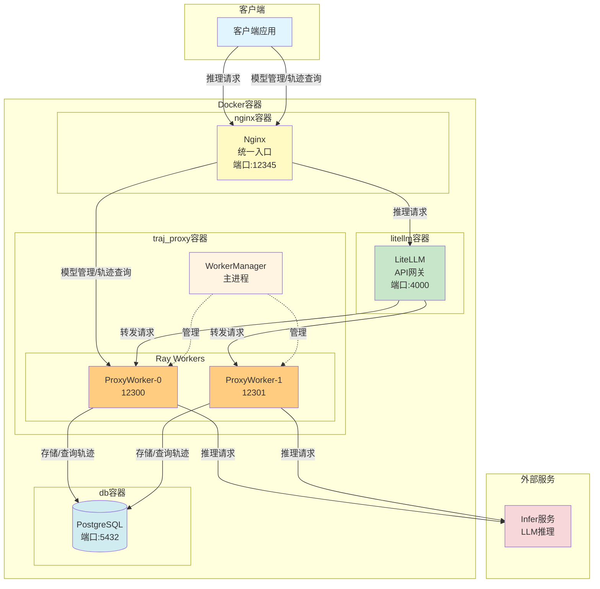
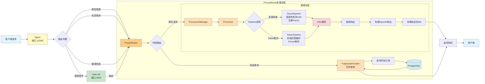

# TrajProxy - LLM 代理服务

TrajProxy 是一个 LLM 请求代理系统，提供 OpenAI 兼容 API、Token-in-Token-out 模式、动态模型管理和请求轨迹记录功能。

## 特性

- **OpenAI 兼容 API** - 无缝对接现有客户端
- **双模式处理** - 直接转发模式（轻量代理）和 Token-in-Token-out 模式（支持前缀匹配缓存）
- **动态模型管理** - 运行时注册/删除模型，跨 Worker 自动同步
- **请求轨迹记录** - 完整的对话历史存储
- **多 Worker 架构** - Ray 分布式处理，高并发支持
- **工具调用解析** - 支持 DeepSeek、Qwen、Hermes 等多种格式的工具调用解析
- **推理内容解析** - 支持思维链内容提取
- **自定义 Parser 支持** - 支持从自定义目录按需发现和加载 parser，无需修改代码即可扩展解析能力

## 🧪 在线工具

| | 工具 | 说明 |
|---|---|---|
| 🔤 | **[Tokenizer Tool](https://versatile-ai.github.io/trajproxy/tokenizer_tool.html)** | 在线对文本进行分词，调试和分析各模型的 Token 切分结果 |
| 🎬 | **[Replay Trajectory Viewer](https://versatile-ai.github.io/trajproxy/replay_trajectory_viewer.html)** | 回放对话请求轨迹，可视化查看完整的推理交互过程 |

## 部署视图



## 请求处理流程



## 架构组件

| 组件 | 端口 | 说明 |
|------|------|------|
| Nginx | 12345 | 统一入口网关，路由推理请求和模型管理请求 |
| LiteLLM | 4000 | API 网关，提供统一的 OpenAI 兼容接口 |
| ProxyWorker | 12300-12320 | 统一的代理服务，集成 LLM 推理和轨迹查询功能 |
| PostgreSQL | 5432 | 数据库存储 |

## 快速开始

### 前置要求

- Python 3.11+
- PostgreSQL 数据库
- LLM 推理服务（如 vLLM、Ollama）

### Docker 部署

```bash
# Docker Compose 模式
./scripts/start_docker_compose.sh start    # 启动服务
./scripts/start_docker_compose.sh stop     # 停止服务
./scripts/start_docker_compose.sh restart  # 重启服务

# All-in-One 模式
./scripts/start_docker_allinone.sh start    # 启动服务
./scripts/start_docker_allinone.sh stop     # 停止服务
./scripts/start_docker_allinone.sh restart  # 重启服务
```

### 验证服务

```bash
# 健康检查
curl http://localhost:12300/health

# 发送请求
curl -X POST http://localhost:12300/v1/chat/completions \
  -H "Content-Type: application/json" \
  -d '{"model": "qwen3.5-2b", "messages": [{"role": "user", "content": "你好"}]}'
```

## 项目结构

```
TrajProxy/
├── dockers/               # Docker 部署相关
│   ├── compose/           # Docker Compose 部署模式
│   │   ├── configs/       # 配置文件
│   │   ├── scripts/       # 启动脚本
│   │   ├── Dockerfile
│   │   └── docker-compose.yml
│   ├── allinone/          # All-in-One 部署模式
│   │   ├── configs/       # 配置文件
│   │   ├── scripts/       # 启动脚本
│   │   └── Dockerfile
│   └── images/            # 镜像文件
├── docs/                  # 详细文档
├── traj_proxy/            # 主代码
│   ├── proxy_core/        # 推理核心（Processor、Pipeline、Converter、Parser、Cache、Builder）
│   ├── serve/             # API 层（路由、数据模型、依赖注入、错误处理）
│   ├── store/             # 存储层（数据库管理、模型仓库、请求仓库、同步器）
│   ├── workers/           # Worker 管理（ProxyWorker、WorkerManager、路由注册）
│   └── utils/             # 工具模块（配置、日志、校验）
├── traj_archiver/         # 独立归档进程（与 traj_proxy 解耦，定时归档过期轨迹详情）
├── tests/                 # 测试
├── scripts/               # 工具脚本
│   ├── init_db.py         # 数据库初始化（建表、分区、索引）
│   ├── archive_records.py # 手动归档脚本
│   ├── download_tokenizer.py
│   └── verify_jinja_consistency.py
├── configs/               # 配置文件
│   └── config.yaml
├── models/                # 模型文件（Tokenizer）
└── custom_parsers/        # 自定义解析器（可选）
    ├── tool_parsers/      # 自定义工具解析器
    └── reasoning_parsers/ # 自定义推理解析器
```

## 文档

详细文档请参阅 [docs/](docs/) 目录：

| 文档 | 说明 |
|------|------|
| [文档中心](docs/README.md) | 完整文档索引和导航 |
| [架构设计](docs/design/architecture.md) | Pipeline 架构、核心组件、处理流程 |
| [API 概览](docs/api/overview.md) | Nginx 入口 vs TrajProxy 直连选型 |
| [ID 设计规范](docs/design/modules/identifiers.md) | run_id、session_id 语义定义 |
| [数据库设计](docs/design/data/schema.md) | 表结构、数据模型、归档机制 |
| [配置详解](docs/guide/configuration.md) | 配置文件说明、环境变量 |
| [部署指南](docs/guide/deployment.md) | 本地开发、Docker 部署 |
| [开发指南](docs/guide/development.md) | 开发环境、测试运行 |
| [Parser 设计](docs/design/modules/parser.md) | 工具调用与推理内容解析 |
| [TITO 方案](docs/design/features/tito.md) | Token-in-Token-out 前缀匹配 |
| [轨迹查看器](docs/tools/trajectory-viewer.md) | 对话轨迹可视化工具 |

## 端口说明

| 端口 | 服务 | 说明 |
|------|------|------|
| 12345 | Nginx | 统一入口网关（Docker 部署） |
| 4000 | LiteLLM | API 网关（Docker 部署） |
| 12300+ | ProxyWorkers | TrajProxy 服务 |
| 5432 | PostgreSQL | 数据库 |

## Parser Implementation Source

TrajProxy 的 Parser 实现（tool parser 和 reasoning parser）从 vLLM v0.16.0 fork 并移植。
通过零侵入式兼容层（`vllm_compat/`），vLLM parser 代码可直接复制使用而无需修改。

| 信息 | 说明 |
|------|------|
| vLLM 对齐版本 | v0.16.0 |
| 项目兼容层 | `traj_proxy/proxy_core/parsers/vllm_compat/` |
| 对齐原则 | 详见 `.opencode/instructions/vllm-alignment.md` |

## 许可证

MIT License
